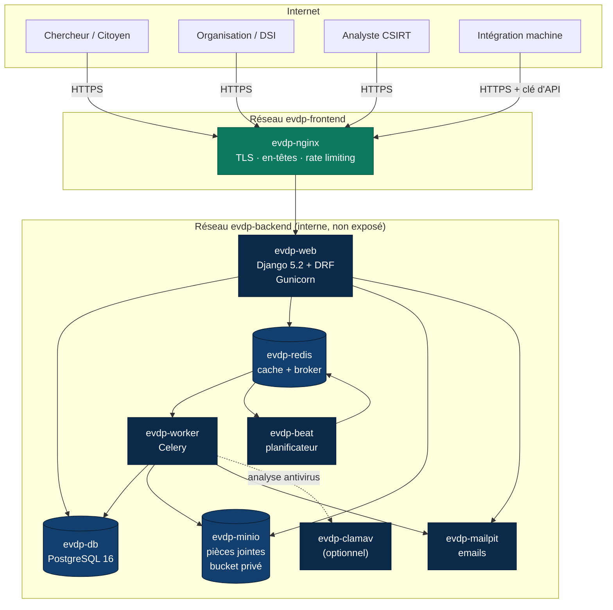

# Diagramme — Architecture de déploiement

**Points clés**

- Seul `evdp-nginx` publie un port vers l'extérieur.
- PostgreSQL, Redis et MinIO ne sont joignables que depuis le réseau interne.
- Les pièces jointes ne sont jamais servies par Nginx : `/media/` retourne 404.
- ClamAV est optionnel ; en son absence l'analyse est marquée `SKIPPED`.
