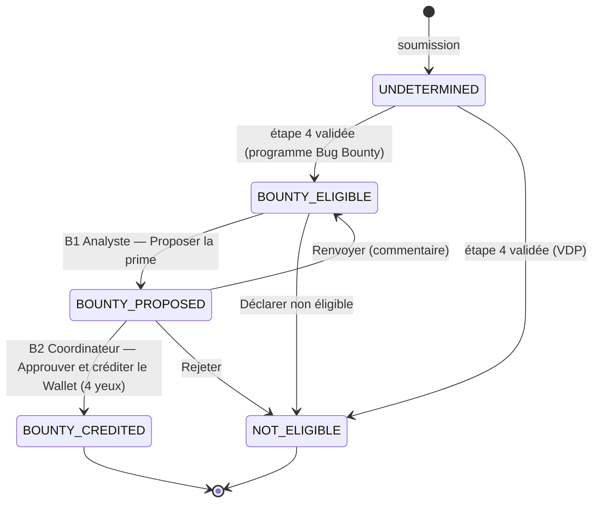
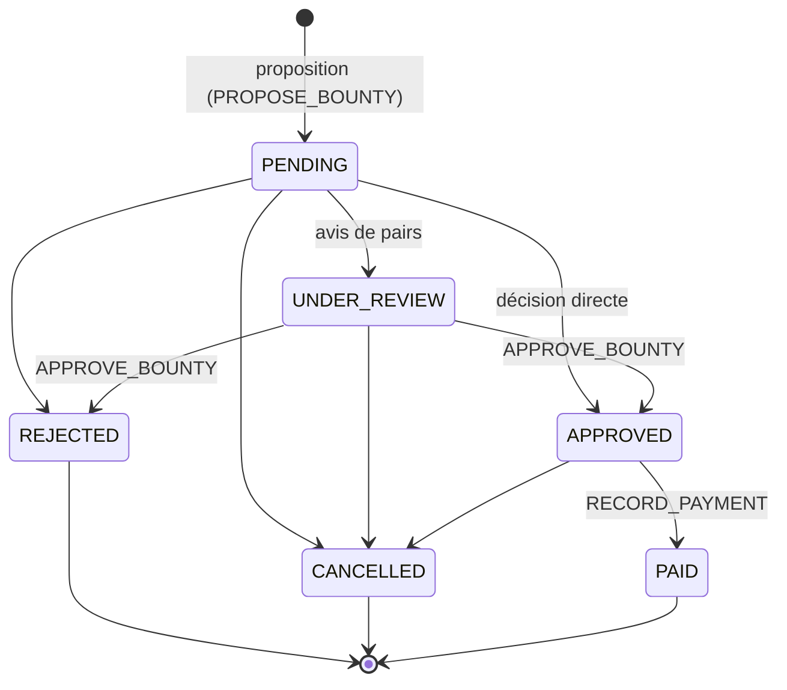

# Diagramme — Workflow Bug Bounty

Workflow v2 : le dossier suit le chemin principal commun (voir
`docs/diagrams/cvd-workflow.md`) ; la prime avance sur une branche
parallèle, portée par `Case.bounty_status`.

## Cycle de vie de la récompense

**Séparation des responsabilités :** proposer, approuver et enregistrer un
versement relèvent de trois capacités distinctes. Un analyste qui propose une
récompense ne peut pas l'approuver.

**Aucun paiement réel** n'est déclenché par la plateforme : `PAID` enregistre
une trace comptable rapprochée d'un versement effectué hors ligne.
