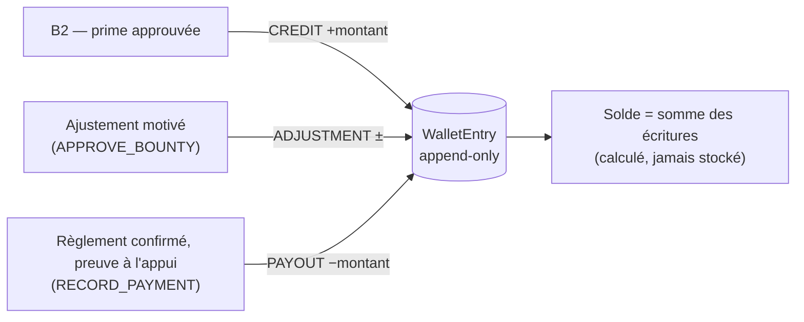
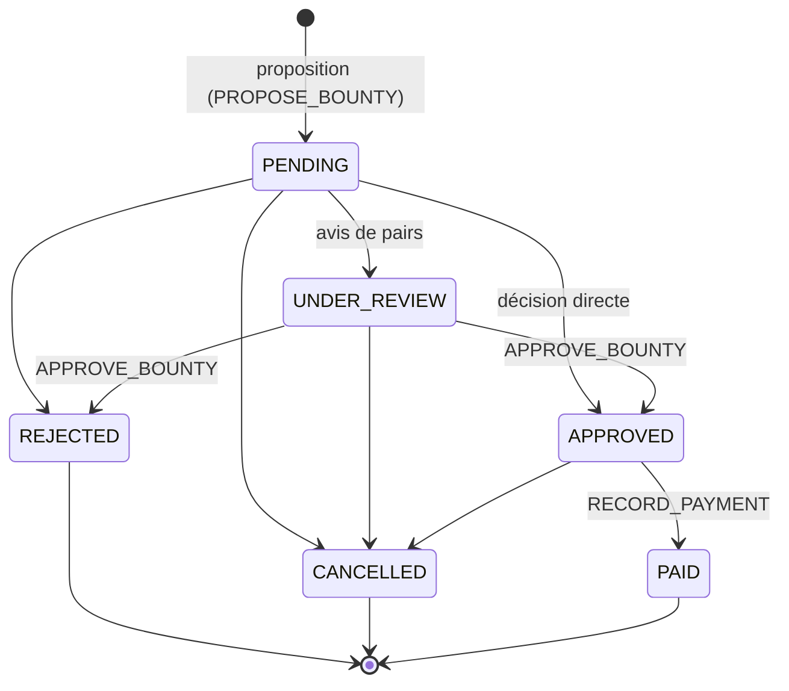

# Diagramme — Branche Bug Bounty et Wallet (workflow v2)

Le dossier Bug Bounty suit le **même chemin principal** que le VDP (voir
`cvd-workflow.md`). La prime se décide en parallèle, sur un champ distinct du
statut du dossier (`Case.bounty_stage`), ouvert dès la validation (étape 4).

```mermaid
stateDiagram-v2
    [*] --> VALIDATED : étape 4 — qualification validée
    VALIDATED --> BOUNTY_ELIGIBLE : programme Bug Bounty, chercheur identifié
    VALIDATED --> NOT_ELIGIBLE : programme non éligible
    BOUNTY_ELIGIBLE --> BOUNTY_PROPOSED : B1 Analyste — Proposer la prime (matrice ; hors palier = justification)
    BOUNTY_PROPOSED --> BOUNTY_ELIGIBLE : Coordinateur — Renvoyer
    BOUNTY_PROPOSED --> BOUNTY_CREDITED : B2 Coordinateur — Approuver et créditer le Wallet (4 yeux)
    BOUNTY_PROPOSED --> NOT_ELIGIBLE : Coordinateur — Refuser la prime
    BOUNTY_CREDITED --> [*]
    NOT_ELIGIBLE --> [*]
```

« Publier et clôturer » (étape 10) reste grisé tant que la prime n'est pas en
`BOUNTY_CREDITED` ou `NOT_ELIGIBLE`.

## Wallet : grand livre d'écritures

## Cycle de vie de la récompense

**Séparation des responsabilités :** proposer, approuver et enregistrer un
versement relèvent de trois capacités distinctes. Un analyste qui propose une
récompense ne peut pas l'approuver.

**Aucun paiement réel** n'est déclenché par la plateforme : `PAID` enregistre
une trace comptable rapprochée d'un versement effectué hors ligne.
