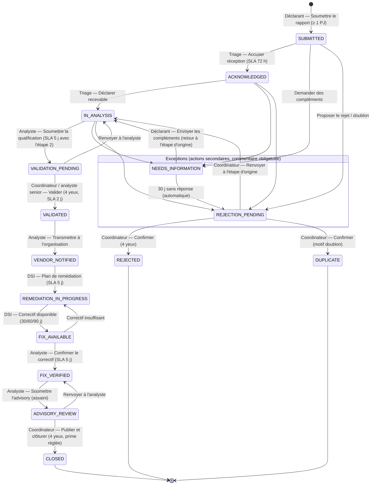
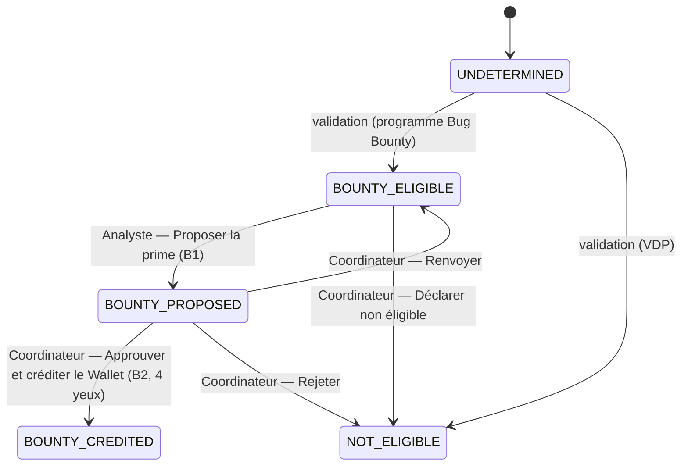

# Diagramme — Workflow v2 (SPEC-eVDP-2026-V2)

Onze étapes principales, un bouton et un seul propriétaire par étape. Les
sorties d'exception sont des actions secondaires, jamais des boutons de
validation. Source : `apps/coordination/workflow.py` (`VDP_TRANSITIONS`).

L'escalade (automatique sur SLA dépassé, ou manuelle par le Coordinateur aux
étapes 6 et 7) ne change pas le statut : elle lève une alerte rouge et
notifie la coordination nationale.

## Branche Bug Bounty (champ `Case.bounty_status`)

« Publier et clôturer » reste grisé tant que la prime n'est ni
`BOUNTY_CREDITED` ni `NOT_ELIGIBLE`.

## Contrôles serveur (`check_transition`)

1. La transition existe pour le statut courant.
2. Le dossier est dans le périmètre de l'utilisateur (sinon 404).
3. L'utilisateur possède la capacité de la transition.
4. Les pré-requis de l'étape sont remplis (liste explicite en cas d'échec).
5. Quatre yeux : l'acteur diffère de l'auteur de l'étape précédente.
6. Commentaire obligatoire (étapes 4, 10, B2 et toutes les exceptions).

Le refus est audité hors transaction ; l'application est atomique et auditée.

## Colonnes Kanban

| Colonne | États regroupés |
|---------|-----------------|
| Réception | `SUBMITTED`, `ACKNOWLEDGED` |
| Analyse | `IN_ANALYSIS`, `NEEDS_INFORMATION`, `VALIDATION_PENDING`, `REJECTION_PENDING` |
| Validé | `VALIDATED`, `VENDOR_NOTIFIED` |
| Remédiation | `REMEDIATION_IN_PROGRESS`, `FIX_AVAILABLE` |
| Publication | `FIX_VERIFIED`, `ADVISORY_REVIEW` |
| Clos | `CLOSED`, `REJECTED`, `DUPLICATE` |

Chaque carte porte un badge d'échéance : vert, orange à 75 % du délai,
rouge à échéance.

## Migration depuis les 24 statuts v1

Voir `apps/coordination/migrations/0008_workflow_v2_data.py` pour le mapping
complet (ex. `RECEIVED` → `SUBMITTED`, `TRIAGE` → `IN_ANALYSIS`,
`VENDOR_CONTACTED`/`VENDOR_ACKNOWLEDGED` → `VENDOR_NOTIFIED`, `PUBLISHED` →
`CLOSED`, `OUT_OF_SCOPE`/`NOT_APPLICABLE`/`INFORMATIVE` → `REJECTED`).
