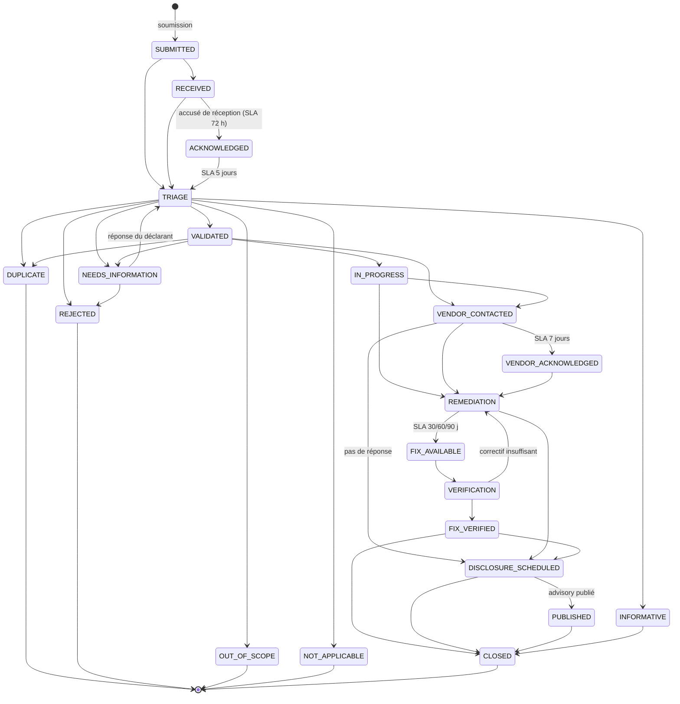

# Diagramme — Workflow CVD (programme VDP)

## Capacités RBAC exigées

| Transition cible | Capacité |
|------------------|----------|
| `VALIDATED`, `REJECTED`, `DUPLICATE`, `OUT_OF_SCOPE`, `NOT_APPLICABLE`, `INFORMATIVE` | `TRIAGE_CASE` |
| `PUBLISHED` | `PUBLISH_ADVISORY` |
| Toutes les autres | `CHANGE_CASE_STATUS` |

Toute transition absente de ce diagramme est refusée par
`apps/coordination/workflow.py` et le refus est journalisé.

## Colonnes Kanban

| Colonne | États regroupés |
|---------|-----------------|
| Soumis | `SUBMITTED`, `RECEIVED`, `ACKNOWLEDGED` |
| Triage | `TRIAGE`, `NEEDS_INFORMATION` |
| Validé | `VALIDATED`, `SEVERITY_ASSIGNED`, `BOUNTY_REVIEW`, `REWARD_APPROVED` |
| Remédiation | `IN_PROGRESS`, `VENDOR_CONTACTED`, `VENDOR_ACKNOWLEDGED`, `REMEDIATION`, `FIX_AVAILABLE` |
| Vérification | `VERIFICATION`, `FIX_VERIFIED` |
| Divulgation | `DISCLOSURE_SCHEDULED`, `PUBLISHED` |
| Clos | `CLOSED`, `REJECTED`, `DUPLICATE`, `OUT_OF_SCOPE`, `NOT_APPLICABLE`, `INFORMATIVE` |
