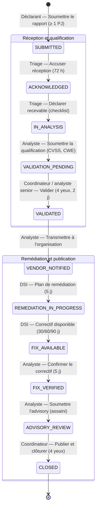
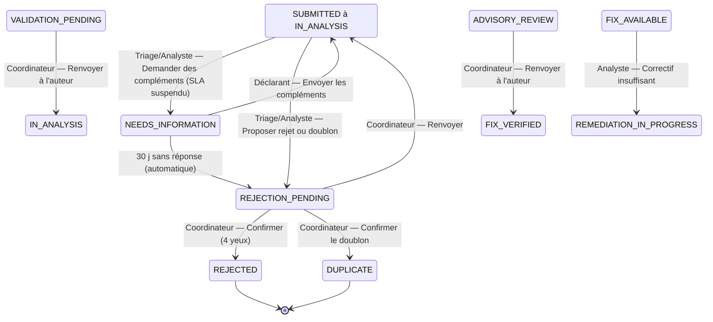

# Diagramme — Workflow v2 (chemin principal et exceptions)

Référence : « Workflow v2 & Matrice RBAC » et `apps/coordination/workflow.py`.
Chaque flèche du chemin principal est **un bouton porté par un seul rôle**.

## Sorties d'exception (actions secondaires, commentaire obligatoire)

**Escalade** (étapes 6 et 7) : automatique sur SLA dépassé ou décidée par le
Coordinateur ; le statut ne change pas (alerte rouge, Coordinateur notifié).
Après 90 jours depuis la notification de l'organisation, le Coordinateur peut
décider une **divulgation à échéance** : « Soumettre l'advisory » devient
possible depuis `VENDOR_NOTIFIED` ou `REMEDIATION_IN_PROGRESS`.

## Capacités RBAC exigées

| Action | Capacité | Rôle(s) |
|--------|----------|---------|
| Accuser réception, Déclarer recevable | `TRIAGE_CASE` | `TRIAGER` |
| Soumettre la qualification (et saisir le CVSS) | `SET_SEVERITY` | `CSIRT_ANALYST` |
| Valider la qualification | `VALIDATE_SEVERITY` | `NATIONAL_COORDINATOR`, analyste senior |
| Transmettre, Confirmer le correctif, Correctif insuffisant | `COORDINATE_VENDOR` | `CSIRT_ANALYST` |
| Plan de remédiation, Correctif disponible | `MANAGE_REMEDIATION` | `DSI_ADMIN`, `ORGANIZATION_MANAGER` |
| Soumettre l'advisory | `DRAFT_ADVISORY` | `CSIRT_ANALYST` |
| Publier et clôturer | `PUBLISH_ADVISORY` | `NATIONAL_COORDINATOR` |
| Demander des compléments | `REQUEST_INFORMATION` | `TRIAGER`, `CSIRT_ANALYST` |
| Proposer rejet / doublon | `PROPOSE_REJECTION` | `TRIAGER`, `CSIRT_ANALYST` |
| Confirmer rejet, renvoyer, escalader, divulgation à échéance | `ARBITRATE_CASE` | `NATIONAL_COORDINATOR` |
| Envoyer les compléments | déclarant du dossier | chercheur |

## Colonnes Kanban

| Colonne | États regroupés |
|---------|-----------------|
| Réception | `SUBMITTED`, `ACKNOWLEDGED`, `NEEDS_INFORMATION` |
| Analyse | `IN_ANALYSIS`, `VALIDATION_PENDING`, `REJECTION_PENDING` |
| Validé | `VALIDATED` |
| Remédiation | `VENDOR_NOTIFIED`, `REMEDIATION_IN_PROGRESS`, `FIX_AVAILABLE` |
| Publication | `FIX_VERIFIED`, `ADVISORY_REVIEW` |
| Clos | `CLOSED`, `REJECTED`, `DUPLICATE` |

Chaque carte porte un badge d'échéance : vert, orange à 75 % du SLA de l'étape
en cours, rouge à échéance.
