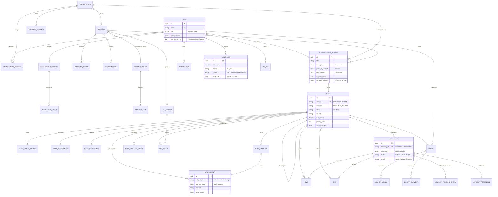
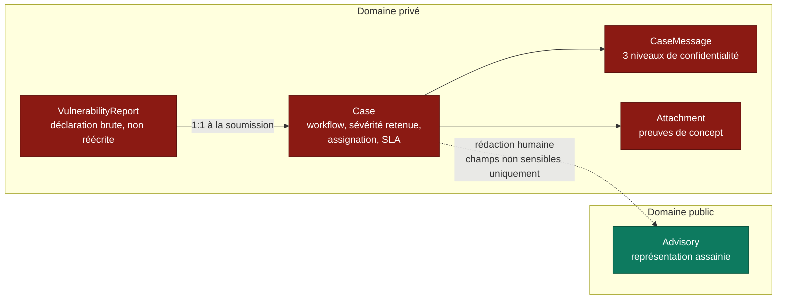

# Diagramme — Modèle de données

## Séparation Rapport / Case

Le trait pointillé est le **seul** chemin du privé vers le public, et il exige
une action humaine habilitée. Aucun champ sensible (preuve de concept, étapes
de reproduction, URL cible, identifiant de dossier) ne le traverse.
