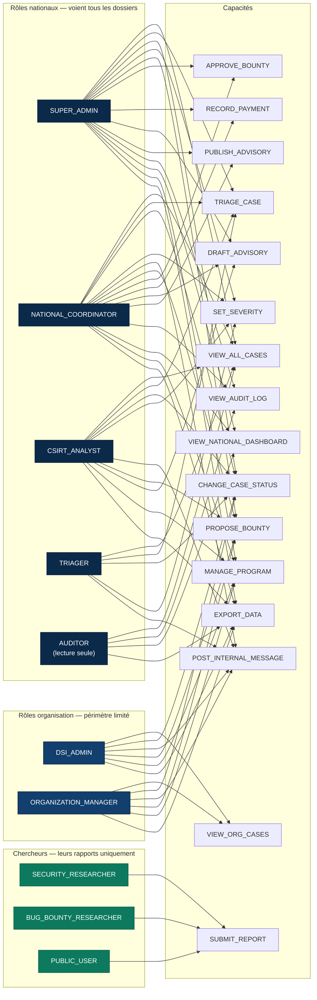
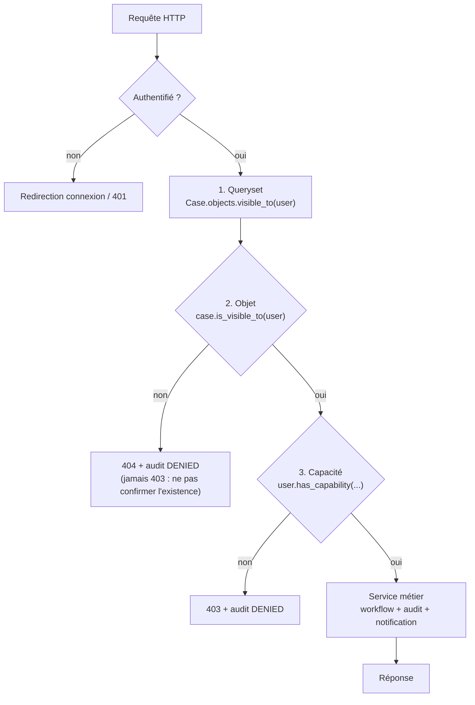

# Diagramme — RBAC

```mermaid
graph LR
    subgraph national["Rôles nationaux — voient tous les dossiers"]
        SA["SUPER_ADMIN"]
        NC["NATIONAL_COORDINATOR"]
        CA["CSIRT_ANALYST"]
        TR["TRIAGER"]
        AU["AUDITOR<br/>(lecture seule)"]
    end

    subgraph orga["Rôles organisation — périmètre limité"]
        DSI["DSI_ADMIN"]
        OM["ORGANIZATION_MANAGER"]
    end

    subgraph chercheurs["Chercheurs — leurs rapports uniquement"]
        SR["SECURITY_RESEARCHER"]
        BR["BUG_BOUNTY_RESEARCHER"]
        PU["PUBLIC_USER"]
    end

    subgraph caps["Capacités"]
        C1["VIEW_ALL_CASES"]
        C2["VIEW_ORG_CASES"]
        C3["TRIAGE_CASE"]
        C4["CHANGE_CASE_STATUS"]
        C5["SET_SEVERITY"]
        C6["POST_INTERNAL_MESSAGE"]
        C7["PROPOSE_BOUNTY"]
        C8["APPROVE_BOUNTY"]
        C9["RECORD_PAYMENT"]
        C10["DRAFT_ADVISORY"]
        C11["PUBLISH_ADVISORY"]
        C12["VIEW_AUDIT_LOG"]
        C13["VIEW_NATIONAL_DASHBOARD"]
        C14["SUBMIT_REPORT"]
        C15["MANAGE_PROGRAM"]
        C16["EXPORT_DATA"]
    end

    SA --> C1 & C3 & C4 & C5 & C7 & C8 & C9 & C10 & C11 & C12 & C13 & C15 & C16
    NC --> C1 & C3 & C4 & C5 & C6 & C7 & C8 & C9 & C10 & C11 & C12 & C13 & C15 & C16
    CA --> C1 & C3 & C4 & C5 & C6 & C7 & C10 & C15 & C16
    TR --> C1 & C3 & C4 & C5 & C6
    AU --> C1 & C12 & C13 & C16
    DSI --> C2 & C4 & C6 & C7 & C15 & C16
    OM --> C2 & C4 & C6 & C7 & C15 & C16
    SR --> C14
    BR --> C14
    PU --> C14

    classDef nat fill:#0b2a4a,stroke:#071c33,color:#fff
    classDef org fill:#123f6d,stroke:#071c33,color:#fff
    classDef res fill:#0d7a5f,stroke:#08553f,color:#fff
    class SA,NC,CA,TR,AU nat
    class DSI,OM org
    class SR,BR,PU res
```

## Trois barrières d'autorisation

```mermaid
flowchart TD
    REQ["Requête HTTP"] --> AUTH{"Authentifié ?"}
    AUTH -->|non| LOGIN["Redirection connexion / 401"]
    AUTH -->|oui| QS["1. Queryset<br/>Case.objects.visible_to(user)"]
    QS --> OBJ{"2. Objet<br/>case.is_visible_to(user)"}
    OBJ -->|non| NF["404 + audit DENIED<br/>(jamais 403 : ne pas confirmer l'existence)"]
    OBJ -->|oui| CAP{"3. Capacité<br/>user.has_capability(...)"}
    CAP -->|non| FORBID["403 + audit DENIED"]
    CAP -->|oui| SVC["Service métier<br/>workflow + audit + notification"]
    SVC --> OK["Réponse"]
```
