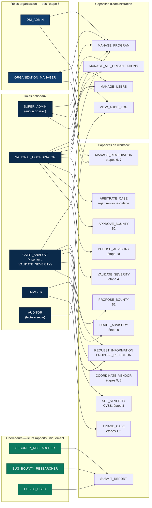
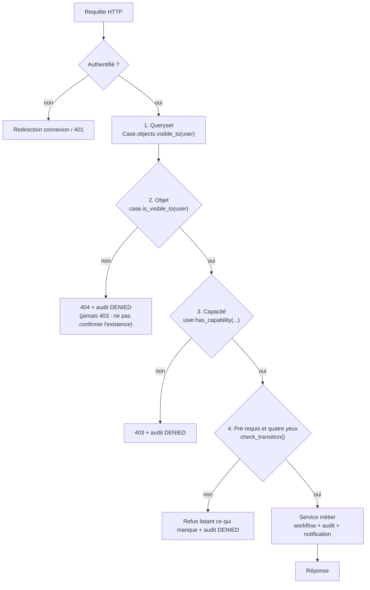

# Diagramme — RBAC (workflow v2)

Chaque étape du workflow a une seule capacité propriétaire. Le super admin
administre la plateforme mais ne voit **aucun** dossier (ISO/IEC 27001 A.5.3).

La matrice de visibilité des données (qui lit quoi) est détaillée dans
`docs/cvd-workflow.md`, section 7, et implémentée dans
`apps/coordination/visibility.py`.

## Trois barrières d'autorisation

