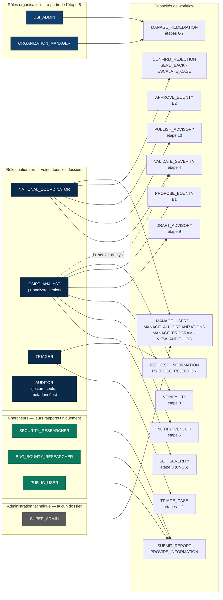
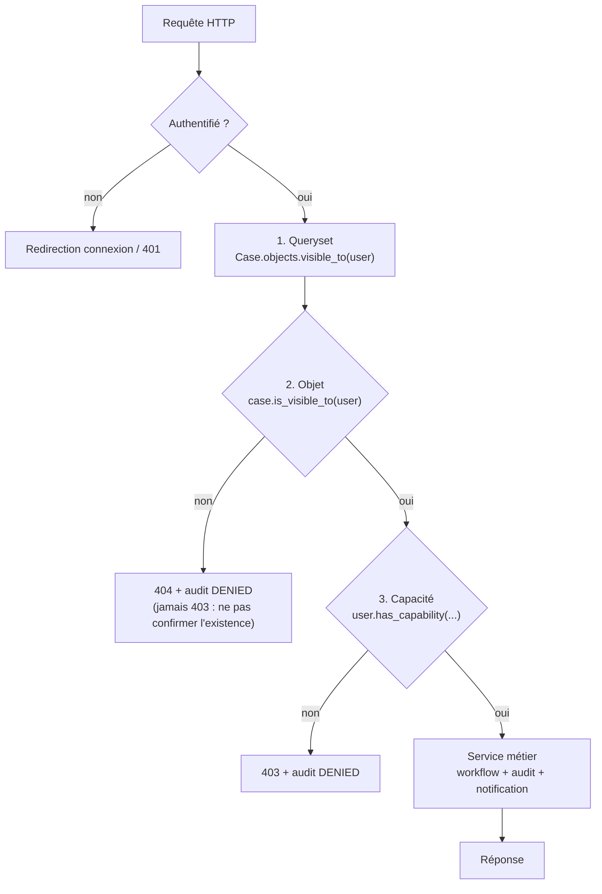

# Diagramme — RBAC

Workflow v2 (SPEC-eVDP-2026-V2) : une capacité par bouton, un propriétaire
par étape. Source : `apps/accounts/roles.py`.

```mermaid
graph LR
    subgraph national["Rôles nationaux — voient tous les dossiers"]
        NC["NATIONAL_COORDINATOR"]
        CA["CSIRT_ANALYST<br/>(+ analyste senior)"]
        TR["TRIAGER"]
        AU["AUDITOR<br/>(lecture seule, métadonnées)"]
    end

    subgraph admin["Administration technique — aucun dossier"]
        SA["SUPER_ADMIN"]
    end

    subgraph orga["Rôles organisation — à partir de l'étape 5"]
        DSI["DSI_ADMIN"]
        OM["ORGANIZATION_MANAGER"]
    end

    subgraph chercheurs["Chercheurs — leurs rapports uniquement"]
        SR["SECURITY_RESEARCHER"]
        BR["BUG_BOUNTY_RESEARCHER"]
        PU["PUBLIC_USER"]
    end

    subgraph caps["Capacités de workflow"]
        W1["TRIAGE_CASE<br/>étapes 1-2"]
        W2["SET_SEVERITY<br/>étape 3 (CVSS)"]
        W3["VALIDATE_SEVERITY<br/>étape 4"]
        W4["NOTIFY_VENDOR<br/>étape 5"]
        W5["MANAGE_REMEDIATION<br/>étapes 6-7"]
        W6["VERIFY_FIX<br/>étape 8"]
        W7["DRAFT_ADVISORY<br/>étape 9"]
        W8["PUBLISH_ADVISORY<br/>étape 10"]
        W9["PROPOSE_BOUNTY<br/>B1"]
        W10["APPROVE_BOUNTY<br/>B2"]
        X1["REQUEST_INFORMATION<br/>PROPOSE_REJECTION"]
        X2["CONFIRM_REJECTION<br/>SEND_BACK · ESCALATE_CASE"]
        X3["SUBMIT_REPORT<br/>PROVIDE_INFORMATION"]
        A1["MANAGE_USERS · MANAGE_ALL_ORGANIZATIONS<br/>MANAGE_PROGRAM · VIEW_AUDIT_LOG"]
    end

    TR --> W1 & X1
    CA --> W2 & W4 & W6 & W7 & W9 & X1
    CA -. "is_senior_analyst" .-> W3
    NC --> W3 & W8 & W10 & X2 & A1
    DSI --> W5
    OM --> W5
    SR --> X3
    BR --> X3
    PU --> X3
    SA --> A1

    classDef nat fill:#0b2a4a,stroke:#071c33,color:#fff
    classDef org fill:#123f6d,stroke:#071c33,color:#fff
    classDef res fill:#0d7a5f,stroke:#08553f,color:#fff
    classDef adm fill:#5a5a5a,stroke:#333,color:#fff
    class NC,CA,TR,AU nat
    class DSI,OM org
    class SR,BR,PU res
    class SA adm
```

## Trois barrières d'autorisation

```mermaid
flowchart TD
    REQ["Requête HTTP"] --> AUTH{"Authentifié ?"}
    AUTH -->|non| LOGIN["Redirection connexion / 401"]
    AUTH -->|oui| QS["1. Queryset<br/>Case.objects.visible_to(user)"]
    QS --> OBJ{"2. Objet<br/>case.is_visible_to(user)"}
    OBJ -->|non| NF["404 + audit DENIED<br/>(jamais 403 : ne pas confirmer l'existence)"]
    OBJ -->|oui| CAP{"3. Capacité<br/>user.has_capability(...)"}
    CAP -->|non| FORBID["403 + audit DENIED"]
    CAP -->|oui| SVC["Service métier<br/>workflow + audit + notification"]
    SVC --> OK["Réponse"]
```
